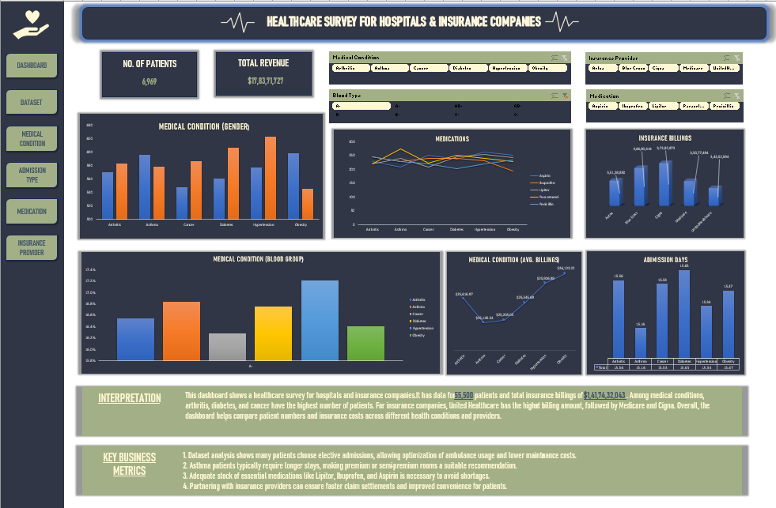

# 🏥 Hospital Analytics Dashboard (Excel)

## 📌 Project Overview

The **Hospital Analytics Dashboard** is an interactive Excel dashboard designed to analyze healthcare data related to patients, medical conditions, insurance providers, and hospital admissions.

This project demonstrates strong skills in **Excel dashboard development, data visualization, and healthcare analytics**, helping stakeholders make data-driven decisions.

---

## 📊 Dashboard Preview

---

## 🎯 Objectives

- Analyze healthcare patient data
- Monitor total patients and revenue
- Compare medical conditions across demographics
- Analyze insurance billing patterns
- Track medication trends
- Understand admission duration trends
- Provide meaningful healthcare insights

---

## 📂 Dataset Description

The dataset used in this project includes healthcare-related attributes such as:

- Patient Details  
- Gender  
- Medical Condition  
- Blood Group  
- Insurance Provider  
- Medication  
- Admission Days  
- Billing Amount  
- Revenue  

---

## 📈 Dashboard Features

### 🔢 Key Performance Indicators (KPIs)

- **Total Patients:** 6,969  
- **Total Revenue:** $17,833,171  

---

### 📊 Visualizations Included

- Medical Condition by Gender (Clustered Column Chart)
- Medication Trends (Line Chart)
- Insurance Billing Analysis (Bar Chart)
- Medical Condition by Blood Group
- Average Billing per Condition
- Admission Days Analysis

---

### 🎛 Interactive Filters (Slicers)

The dashboard includes interactive slicers for:

- Medical Condition
- Insurance Provider
- Medication
- Blood Type

---

## 🧠 Key Insights

- Arthritis, Diabetes, and Cancer have the highest patient counts.
- United Healthcare shows the highest billing amount among providers.
- Asthma patients generally have longer admission durations.
- Medication usage varies significantly across medical conditions.
- Billing amounts differ across insurance providers.

---

## 🛠 Tools & Technologies Used

- Microsoft Excel  
- Pivot Tables  
- Pivot Charts  
- Slicers  
- Conditional Formatting  
- Data Visualization Techniques  

---

## 📁 Project Structure
